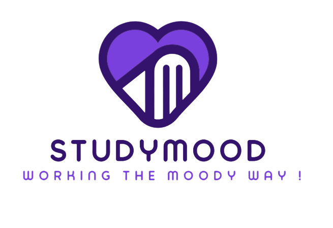

  

# StudyMood

## Table of Content

* [About](#about)
* [Licence](#licence)

## About

> [!note] Study the Moody Way
> A Study Website to get in the mood !

## Licence

[MIT](https://github.com/Only-Facts/StudyMood/blob/18a7e0c8d0d59ffb92b3b77e87fc05caf9077b77/LICENSE)

